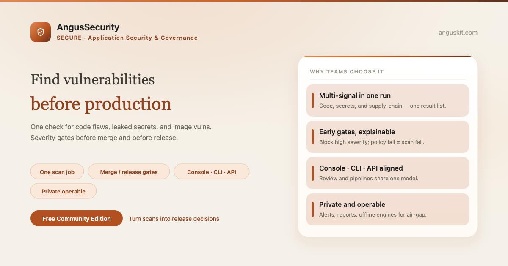
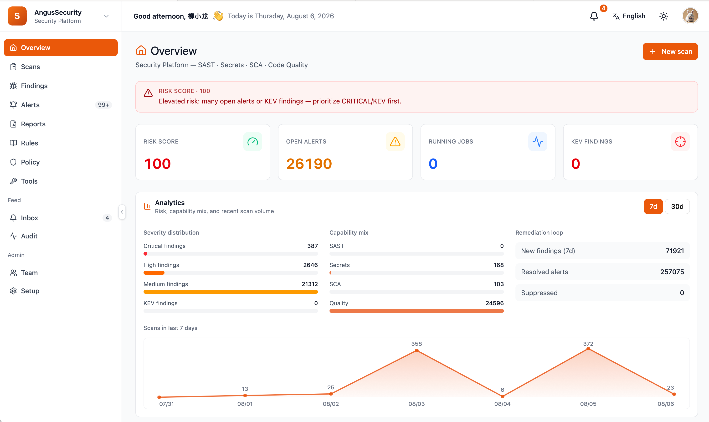

**English** | [简体中文](README.zh.md)

<p align="center">
  
</p>

<p align="center">
  <a href="https://www.anguskit.com/en/pricing"></a>
  <a href="LICENSE"></a>
  <a href="https://www.anguskit.com/en/docs/security"></a>
  <a href="https://www.anguskit.com"></a>
</p>

# AngusSecurity

**Detect Deep. Gate Early. Secure Code, Secrets & Supply Chain.**

Application Security & Governance — the Secure product in [AngusKit](https://github.com/AngusKit/AngusKit).

> **This repository hosts documentation only.** AngusSecurity source code is distributed through private deployment packages, not through this GitHub repository. Earlier revisions of this repository contained application source; as of this update, distribution has moved to AngusKit's packaging pipeline (see [Get the Community Edition](#get-the-community-edition-free) below). This repository now focuses on product information, quickstart guides, and links to the full documentation site.

## What is AngusSecurity

AngusSecurity runs one check across code flaws, leaked secrets, and dependency/image vulnerabilities, then gates merges and releases by severity — turning scan output into an executable release decision instead of a report nobody reads. It wraps OpenGrep (SAST), Gitleaks (secrets), Trivy (SCA/image), and a SonarQube Scanner integration behind one console, CLI, and API.

## Key capabilities

- **Multi-signal detection out of the box** — code security, secrets, and dependency/image vulnerabilities in one job, one result list
- **Unified issue governance** — normalized, deduplicated findings across engines; timed suppressions for false positives; secrets masked by default
- **Merge & release gates** — block high-severity findings before merge, complete supply-chain evidence before release
- **Alerts & report loop** — actionable alerts and archivable reports (JSON/HTML/CSV) for release and audit packs
- **Console · CLI · API** — pipelines and human review share the same result model, with offline engine bundles for air-gapped use
- **Git & artifact linkage** — trigger scans on push/PR, gate artifacts at ingest, one integration across the suite

## Screenshot

<p align="center">
  
</p>

## Get the Community Edition (free)

```bash
curl -LO https://repo.anguskit.com/raw/raw-public/AngusKit/security/AngusSecurity-Community-1.0.0.zip
unzip AngusSecurity-Community-1.0.0.zip
cd AngusSecurity-1.0.0/docker
cp env.example .env
docker compose --profile mysql up -d
```

- Minimum: **2 cores / 4 GB** (recommended: 4 cores / 8 GB); disk 40 GB+ (scan engines add to this)
- Ports after install: AngusGM `8801` (sign-in), AngusSecurity `8809`
- Only need AngusSecurity? This zip includes AngusSecurity + AngusGM — no other product required.

Full installation guide (host ZIP, Kubernetes/Helm, TLS, upgrades, engine setup): **[docs.anguskit.com/security](https://www.anguskit.com/en/docs/security/latest/en/manual/02-install-deploy)**

## Community vs. Team / Enterprise vs. SaaS

| | Community | Team / Enterprise | SaaS |
|---|---|---|---|
| Price | Free | Paid, private deployment | Paid, hosted |
| Users | Up to 10 | Higher / unlimited seats | Per plan |
| Scan sources (repos/targets) | Up to 20 | Higher / unlimited | Per plan |
| Scans | Up to 100 / month | Higher / unlimited | Per plan |
| SCA, image deep scan, policy gates, Git/artifact integration, MCP | Not included (code defect + secret detection only) | Included | Per plan |

Community Edition source is licensed under GPL-3.0 and distributed with each Community installation package. Team and Enterprise editions are proprietary, governed by the **XCan Business License, Version 1.0**, distributed only under a paid subscription.

Full pricing and feature comparison: **[anguskit.com/pricing](https://www.anguskit.com/en/pricing)**

## Related AngusKit products

| Product | Focus | Repository |
|---|---|---|
| AngusKit | The full suite (this product + 5 others + AngusGM) | [AngusKit/AngusKit](https://github.com/AngusKit/AngusKit) |
| AngusAI | AI agent development | [AngusKit/AngusAI](https://github.com/AngusKit/AngusAI) |
| AngusGit | AI-native code collaboration | [AngusKit/AngusGit](https://github.com/AngusKit/AngusGit) |
| AngusRepo | Universal artifact management | [AngusKit/AngusRepo](https://github.com/AngusKit/AngusRepo) |
| AngusTester | AI-native software testing | [AngusKit/AngusTester](https://github.com/AngusKit/AngusTester) |
| AngusInsight | Private product analytics | [AngusKit/AngusInsight](https://github.com/AngusKit/AngusInsight) |

## Documentation & support

- Full docs: [anguskit.com/docs/security](https://www.anguskit.com/en/docs/security)
- Contact / sales: [anguskit.com/contact](https://www.anguskit.com/en/contact) · `sales@anguskit.com`
- This repository's Issues are for **documentation feedback and install troubleshooting**. This repository does not accept source code pull requests — see [CONTRIBUTING.md](CONTRIBUTING.md).

## License

- This repository's documentation content: see [LICENSE](LICENSE) (GPL-3.0, matching the Community Edition source it describes).
- AngusSecurity Community Edition product source: GPL-3.0, distributed with each Community installation package.
- AngusSecurity Team / Enterprise Edition: proprietary, XCan Business License v1.0, distributed under a paid subscription only.
