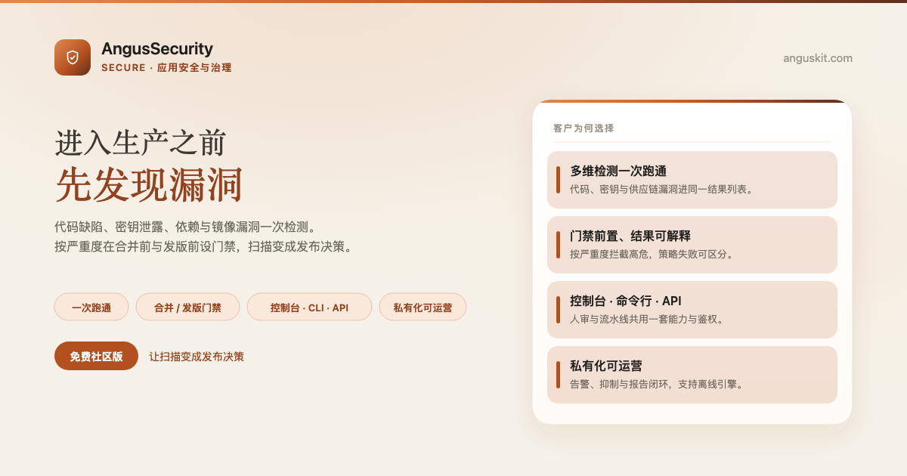
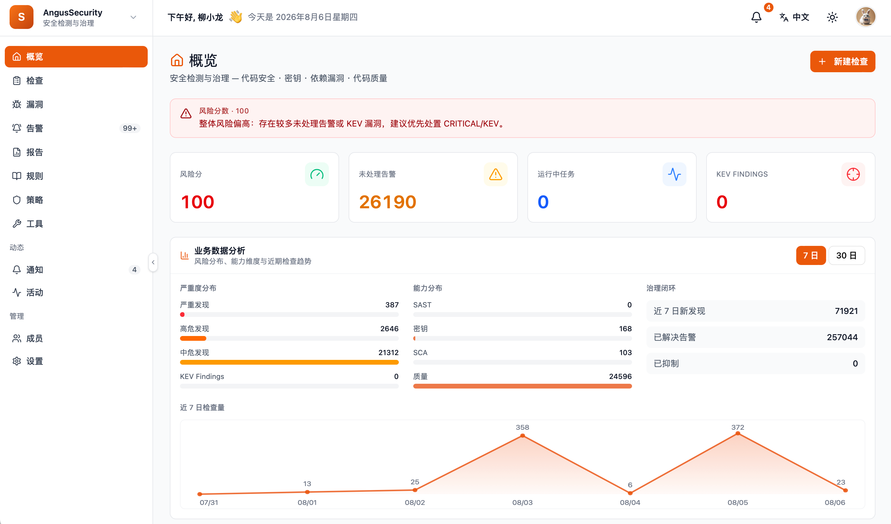

[English](README.md) | **简体中文**

<p align="center">
  
</p>

<p align="center">
  <a href="https://www.anguskit.com/zh/pricing"></a>
  <a href="LICENSE"></a>
  <a href="https://www.anguskit.com/zh/docs/security"></a>
  <a href="https://www.anguskit.com"></a>
</p>

# AngusSecurity

**检测要深，门禁要早：守住代码、密钥与供应链安全。**

应用安全与治理——[AngusKit](https://github.com/AngusKit/AngusKit) 中负责 Secure 的产品。

> **本仓库仅承载文档内容。** AngusSecurity 的产品源码通过私有化安装包分发，不在本 GitHub 仓库公开。本仓库此前版本曾包含应用源码；本次更新后，源码分发已统一收拢到 AngusKit 的打包发布流水线（见下文「免费获取社区版」）。本仓库现聚焦于产品信息、快速上手指引，以及指向完整文档站的链接。

## AngusSecurity 是什么

AngusSecurity 一次检查覆盖代码缺陷、密钥泄露与依赖/镜像漏洞，按严重度在合并前与发版前设门禁——把扫描结果变成可执行的发布决策，而不是一份没人看的报告。它把 OpenGrep（SAST）、Gitleaks（密钥检测）、Trivy（SCA/镜像）与 SonarQube Scanner 集成统一收进同一套控制台、命令行与 API。

## 核心能力

- **多维检测开箱即用**——代码安全、密钥与依赖/镜像漏洞一次跑通，结果进同一列表
- **问题统一治理**——跨引擎结果归一化去重；误报可限时忽略，密钥片段默认打码
- **合并与发版门禁**——按严重度阈值拦截高危合入，发版前补齐供应链证据
- **告警与报告闭环**——告警可处置，报告可归档（JSON/HTML/CSV），发版与审计材料随手可得
- **控制台·命令行·API**——流水线与人工评审共用同一套结果模型，引擎包可离线交付
- **与 Git/制品库联动**——推送与合并请求可触发检查，制品侧可设门禁，一次接入即可覆盖套件

## 产品截图

<p align="center">
  
</p>

## 免费获取社区版

```bash
curl -LO https://repo.anguskit.com/raw/raw-public/AngusKit/security/AngusSecurity-Community-1.0.0.zip
unzip AngusSecurity-Community-1.0.0.zip
cd AngusSecurity-1.0.0/docker
cp env.example .env
docker compose --profile mysql up -d
```

- 最低配置：**2 核/4 GB**（推荐 4 核/8 GB）；磁盘 40 GB 起（扫描引擎会额外占用）
- 安装完成后端口：AngusGM `8801`（登录入口）、AngusSecurity `8809`
- 只需要 AngusSecurity？这份 zip 已包含 AngusSecurity + AngusGM，无需其它产品。

完整安装指南（主机 ZIP、Kubernetes/Helm、TLS、升级、引擎配置）：**[docs.anguskit.com/security](https://www.anguskit.com/zh/docs/security/latest/zh/manual/02-install-deploy)**

## 社区版 vs 团队版/企业版 vs SaaS

| | 社区版 | 团队版/企业版 | SaaS |
|---|---|---|---|
| 价格 | 免费 | 付费，私有化部署 | 付费，云端托管 |
| 用户数 | 最多 10 | 更高/不限席位 | 按套餐 |
| 扫描源（仓库/目标）数 | 最多 20 | 更高/不限 | 按套餐 |
| 扫描次数 | 最多 100 次/月 | 更高/不限 | 按套餐 |
| SCA、镜像深度扫描、策略门禁、Git/制品联动、MCP | 不含（仅代码缺陷 + 密钥检测） | 包含 | 按套餐 |

社区版源码使用 GPL-3.0 协议，随社区版安装包一同分发。团队版与企业版为专有软件，受 **XCan Business License, Version 1.0** 约束，仅随付费订阅提供。

完整定价与功能对照：**[anguskit.com/pricing](https://www.anguskit.com/zh/pricing)**

## AngusKit 关联产品

| 产品 | 定位 | 仓库 |
|---|---|---|
| AngusKit | 完整套件（本产品 + 其它 5 个 + AngusGM） | [AngusKit/AngusKit](https://github.com/AngusKit/AngusKit) |
| AngusAI | AI 智能体开发 | [AngusKit/AngusAI](https://github.com/AngusKit/AngusAI) |
| AngusGit | AI 原生代码协作 | [AngusKit/AngusGit](https://github.com/AngusKit/AngusGit) |
| AngusRepo | 通用制品管理 | [AngusKit/AngusRepo](https://github.com/AngusKit/AngusRepo) |
| AngusTester | AI 原生软件测试 | [AngusKit/AngusTester](https://github.com/AngusKit/AngusTester) |
| AngusInsight | 私有化产品分析 | [AngusKit/AngusInsight](https://github.com/AngusKit/AngusInsight) |

## 文档与支持

- 完整文档：[anguskit.com/docs/security](https://www.anguskit.com/zh/docs/security)
- 联系/销售：[anguskit.com/contact](https://www.anguskit.com/zh/contact) · `sales@anguskit.com`
- 本仓库的 Issues 仅用于**文档反馈与安装排查**。本仓库不接受源码 Pull Request，详见 [CONTRIBUTING.md](CONTRIBUTING.md)。

## License

- 本仓库文档内容：见 [LICENSE](LICENSE)（GPL-3.0，与其描述的社区版源码保持一致）。
- AngusSecurity 社区版产品源码：GPL-3.0，随每个社区版安装包分发。
- AngusSecurity 团队版/企业版：专有软件，XCan Business License v1.0，仅随付费订阅提供。
